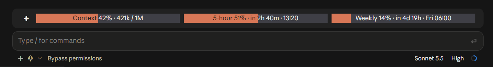

# claude-usage-mod

> The repository is named `claude-usage-mod`; the plugin is named `usage-mod` (Anthropic does not allow third-party plugin names to start with `claude-`).

[中文](README.md) | **English**

A Claude Code mod that shows **context usage, the 5-hour limit, the weekly limit** and their reset times in a row above the prompt, with a one-click button to compact the context.



Available in Simplified Chinese, Traditional Chinese, English and Japanese. See [plugins/usage-mod](plugins/usage-mod/README.en.md) for details.

## Install

Requires **Claude Code 2.1.287 or later** (check with `claude --version`).

```bash
claude plugin marketplace add qingyashizi/claude-usage-mod
claude plugin install usage-mod@usage-mod
```

In a session that is already open, run `/reload-plugins` to load it; otherwise it loads the next time you start Claude Code. To update:

```bash
claude plugin marketplace update usage-mod
```

## Read this before installing

A mod is code that runs with your permissions and is not sandboxed. Before installing, you can clone the repository and list what it does:

```bash
claude plugin validate ./plugins/usage-mod
```

The `hooks:` and `calls:` lines in the output show which events the mod handles and what it asks Claude Code to do. This mod makes no network requests; it only reads and writes one cache file inside its own folder.

## License

MIT.
