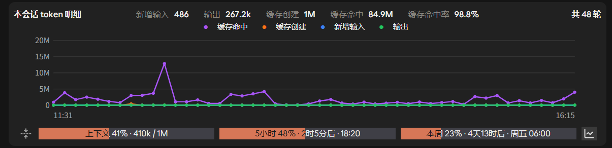

# claude-usage-mod

> 仓库名是 `claude-usage-mod`;插件名是 `usage-mod`(Anthropic 不允许第三方插件名以 `claude-` 开头)。

**中文** | [English](README.en.md)

Claude Code 用量显示 Mod:在输入框上方常驻显示**上下文占用、5 小时额度、每周额度**和重置时间,带一个一键压缩上下文的按钮,还能点最右边的图标展开**每一轮回复的 token 用量折线图**(缓存命中 / 缓存创建 / 新增输入 / 输出,鼠标移上去看每一轮的开始、结束时间和用时)。



支持简体中文、繁體中文、English、日本語。详细说明见 [plugins/usage-mod](plugins/usage-mod/README.md)。

## 安装

需要 **Claude Code 2.1.287 或更高版本**(`claude --version` 查看)。

**以下命令在终端里执行**,不是在 Claude Code 的对话框里输入。终端可以是系统自带的 PowerShell、Windows Terminal(macOS / Linux 用自带的终端),或者桌面应用侧边的 Terminal 面板。

```bash
claude plugin marketplace add qingyashizi/claude-usage-mod
claude plugin install usage-mod@usage-mod
```

- 第一行:告诉 Claude Code,把 GitHub 上的 `qingyashizi/claude-usage-mod`(格式是 `用户名/仓库名`)登记成一个"插件市场",也就是一份可以从中挑插件的清单。这一步只是登记,**还没有安装任何东西**。
- 第二行:从刚登记的市场里安装插件。`usage-mod@usage-mod` 的格式是 `插件名@市场名`,这里两个名字碰巧一样:前一个是插件,后一个是市场。

已经打开的会话里运行 `/reload-plugins` 加载,否则下次启动生效。更新:

```bash
claude plugin marketplace update usage-mod
```

## 安装前请先看

Mod 是以你的权限运行的代码,没有沙箱。装之前可以先把仓库克隆下来,用下面的命令看它会做什么:

```bash
claude plugin validate ./plugins/usage-mod
```

输出里的 `hooks:` 和 `calls:` 两行,就是它挂了哪些事件、调用了哪些能力。本 Mod 不联网,只读写自己文件夹下的一个缓存文件。

## 卸载

同样在终端里执行:

```bash
claude plugin uninstall usage-mod@usage-mod
claude plugin marketplace remove usage-mod   # 可选:把添加过的市场也移除
```

只想暂时关掉:`claude plugin disable usage-mod@usage-mod`。更多见 [plugins/usage-mod](plugins/usage-mod/README.md)。

## 许可证

MIT。
