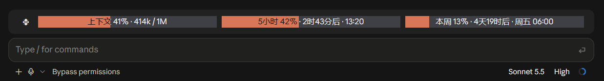

# usage-mod

**中文** | [English](README.en.md)

给 Claude Code 的一个小 Mod:在输入框上方常驻显示三项用量,并带一个一键压缩上下文的按钮。



从左到右:压缩按钮、上下文占用、5 小时额度、每周额度。

## 功能

- **上下文占用**:已用百分比和 token 数。
- **5 小时额度**:已用百分比、还剩多久重置、具体几点重置。
- **每周额度**:同上。
- **一键压缩**:最左边的 🗜 图标,点一下直接压缩上下文,效果等同于输入 `/compact`。鼠标移上去有提示。
- 三块等宽,橙色(`#D77757`)填充表示已用比例,颜色固定,不随用量变化。
- 用量到 90% 时弹一次提醒。
- 每 5 秒读一次最新数据,不用等一轮回复结束。

## 语言

支持 **简体中文(`zh`)、繁體中文(`zh-TW`)、English(`en`)、日本語(`ja`)**,默认简体中文。

切换方法:在 Claude Code 里运行 `/plugin`,找到 usage-mod,把 **Language / 语言** 改成想要的;或者在 `~/.claude/settings.json` 里设置:

```json
{
  "pluginConfigs": {
    "usage-mod": { "options": { "language": "en" } }
  }
}
```

改完模块会自动重新加载。语言代码写错时退回简体中文。(通过市场安装时,`pluginConfigs` 里的键名以 `/plugin` 里显示的为准,最稳妥的办法是直接在 `/plugin` 里改。)

想加别的语言:打开 `hooks/i18n.ts`,复制一份词典翻译,在 `DICTS` 里登记,再把语言代码加进 `.claude-plugin/plugin.json` 的 `userConfig.language.options`。

## 版本要求

Mod 需要 **Claude Code 2.1.287 或更高版本**,从这个版本起默认开启。用 `claude --version` 查看。

本 Mod 是在 2.1.286 上开发的,2.1.286 及更早的版本需要额外设置环境变量 `CLAUDE_CODE_ENABLE_FUNCTION_HOOKS=1`(见下面"手动加载")。2.1.287 起这个变量会被忽略,不用设。

## 安装

### 方式一:从市场安装

```bash
claude plugin marketplace add qingyashizi/claude-usage-mod
claude plugin install usage-mod@usage-mod
```

已经打开的会话里运行 `/reload-plugins` 加载,否则下次启动生效。

### 方式二:手动加载

先把整个 `usage-mod` 文件夹放到你喜欢的位置,比如 `~/.claude/mods/usage-mod`。

**临时试用**(只对这一次启动有效):

```bash
claude --plugin-dir ~/.claude/mods/usage-mod
```

**长期使用**:在 `~/.claude/settings.json` 里加一个 `env` 块,路径换成你自己的。新开的会话才会加载。

```json
{
  "env": {
    "CLAUDE_CODE_PLUGIN_DIRS": "C:\\Users\\你的用户名\\.claude\\mods\\usage-mod"
  }
}
```

2.1.286 及更早的版本还要在 `env` 里加 `"CLAUDE_CODE_ENABLE_FUNCTION_HOOKS": "1"`。想让改动代码后不重启就生效,再加 `"CLAUDE_CODE_PLUGIN_DIR_WATCH": "1"`。

### 安装前先看它做什么

Mod 是在 Claude Code 里面以你的权限运行的代码,没有沙箱。安装前可以先列出它挂了哪些事件、调用了哪些能力:

```bash
claude plugin validate ./usage-mod
```

输出里的 `hooks:` 和 `calls:` 两行就是答案。本 Mod 会用到:读取用量(`$.session.usage`)、运行 `/compact` 命令来压缩上下文(`$.command.run`)、读写自己文件夹下的 `cache/limits.json`(`$.fs.read` / `$.fs.write`)、弹提示(`$.ui.toast`)、定时器(`$.clock`)。不联网,不读别的文件。

### 运行位置

- 终端里的 `claude`:横条和按钮都能显示。
- 桌面应用的 Code 标签页:能显示(WSL 会话里不支持插件)。
- VS Code 扩展、`claude -p`、云端会话:Mod 会运行,但横条不会显示。

## 自定义

颜色、图标等在 `hooks/register.tsx` 开头的常量里,所有显示的文字(包括悬停提示 `tip`)在 `hooks/i18n.ts` 里:

| 常量 | 作用 |
|---|---|
| `ORANGE` | 已用部分的填充色 |
| `WARM` | 剩余部分的底色 |
| `DARK` / `LIGHT` | 填充内 / 填充外的文字色 |
| `ICON` | 压缩按钮的图标,图标显示不出来时换成别的字符 |
| `WARN` | 弹提醒的百分比阈值,默认 90 |

## 已知限制

- **Mod 的接口目前是早期访问**,会随 Claude Code 版本变化。本 Mod 在 2.1.286 上开发和测试,别的版本可能加载失败或显示异常。
- **切换到一个本次启动后还没打开过的会话时,横条要等几秒才出现。**实测(桌面应用、Claude Code 2.1.289,十几次)约 2.5 到 5.5 秒,平均约 4 秒;已经打开过的会话再切回来是即时的。这段时间基本花在引擎里,Mod 管不了:从 Mod 加载完到它的启动钩子开始约 1 秒,启动钩子结束到横条第一次画出来又约 1.7 秒,Mod 自己的初始化只占零点几秒。试过让初始化不阻塞,耗时没有明显变化(平均 4.3 秒对 4.0 秒,在波动范围内)。
- **5 小时和每周额度只有在本次进程收到过一次回复后才有真实值**。新会话里会先显示上次存下的数据(存在 mod 文件夹下的 `cache/limits.json`),已经过了重置时间的会被丢掉,显示成"—"。这是引擎给数据的方式决定的。
- **横条背景上下的内边距是应用自己的**,Mod 改不了。
- 桌面应用里悬停提示由应用画成深色卡片,所以提示文字用的是浅色;终端里是橙底深字。
- 窗口窄于 78 列时,退回成一行简短文字,此时没有压缩按钮。
- 压缩会把之前的对话换成摘要,细节会丢,**点了就直接执行,没有确认步骤**。
- **压缩要等模型把对话总结一遍,上下文大时会比较久。**实测约 41 万 token 用了 63 秒。点下去后先弹"正在压缩上下文…",完成时再弹"已压缩上下文",中间没有进度显示,也别重复点。
- 桌面应用的会话是 SDK(无头)会话,引擎不允许 Mod 直接调用压缩接口(`$.session.compact`),所以按钮的做法是替你运行一次 `/compact` 命令(`$.command.run`)。这个办法只在桌面应用里验证过,终端里没有试过。
- AI 正在回复时点按钮:按引擎文档,命令会排队,等这一轮结束再执行。这一点没有亲自验证过。
- 作者只在本地用 `--plugin-dir` 和 `CLAUDE_CODE_PLUGIN_DIRS` 验证过;通过市场安装是按官方文档写的,没有亲自试过。

## 卸载

把 `settings.json` 里的 `CLAUDE_CODE_PLUGIN_DIRS` 那一项去掉(或改掉路径),再删掉文件夹即可。

## 许可证

MIT,见 `LICENSE`。
