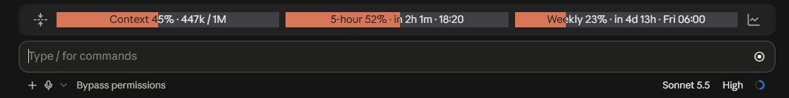
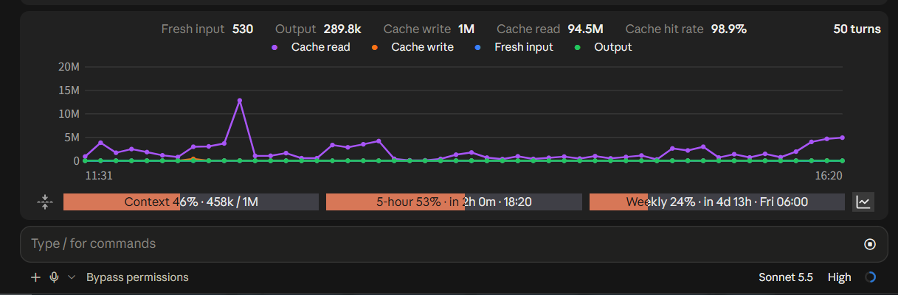

# usage-mod

[English](README.md) | [简体中文](README.zh-CN.md) | **繁體中文** | [日本語](README.ja.md)

給 Claude Code 的一個小 Mod:在輸入框上方常駐顯示三項用量,附帶一個一鍵壓縮上下文的按鈕,還能展開查看每一輪回覆的 token 用量折線圖。



(截圖是英文介面。)從左到右:壓縮按鈕、上下文佔用、5 小時額度、每週額度、展開明細按鈕。點最右邊的圖示,橫條上方就會展開 token 明細圖(見下面的「Token 明細圖」);再點一下收起。

## 功能

- **上下文佔用**:已用百分比和 token 數。
- **5 小時額度**:已用百分比、還剩多久重置、具體幾點重置。
- **每週額度**:同上。
- **一鍵壓縮**:最左邊的線條圖示(四個箭頭向中間收),點一下直接壓縮上下文,效果等同於輸入 `/compact`。滑鼠移上去有提示。
- **展開 token 明細**:最右邊的折線圖示,點一下在橫條上方展開每一輪回覆的 token 用量折線圖,再點收起。詳見下面的「Token 明細圖」。
- 三塊等寬,橘色(`#D77757`)填滿表示已用比例,顏色固定,不隨用量變化。
- 用量到 90% 時彈出一次提醒。
- 每 5 秒讀取一次最新資料,不用等一輪回覆結束。

## Token 明細圖

點橫條最右邊的折線圖示展開,再點收起。



展開後從上到下:

- **第一行**:標題、五項合計、共幾輪。合計是這個工作階段裡 Mod 記到的所有回覆加起來的:
  - **新增輸入**:沒走快取、這次新送給模型的輸入 token。
  - **輸出**:模型產生的 token。
  - **快取建立**:這次新寫進提示快取的 token。
  - **快取命中**:從提示快取讀到的 token,比新送的便宜很多。
  - **快取命中率**:快取命中 ÷(新增輸入 + 快取建立 + 快取命中)。
- **第二行**:四條曲線的開關,點圖例上的名稱就顯示 / 隱藏對應的曲線。快取命中通常比其他三項大好幾個數量級,在同一根縱軸上其他曲線會被壓成貼地的線;把它隱藏後,其餘幾項的起伏才看得出來。
- **折線圖**:每一輪回覆一個點,橫軸依時間順序(左下和右下標出最早和最近的時刻),縱軸是 token 數。最多保留最近 50 輪。
- **滑鼠移到某一輪上**:那一欄會亮起,旁邊彈出一張半透明的明細卡片:開始時刻 → 結束時刻、耗時、模型,以及這一輪的四項數字。子代理的回覆會在模型名稱後面標註。

需要知道的幾點:

- 資料只來自**目前的工作階段**,而且只記 Mod **載入之後**的回覆。重新啟動或 `/reload-plugins` 後重新累計,不會存到檔案裡。
- 「耗時」是實際經過的時間,你讓它停著等你的那段也算在內:離開一小時再回來,這一輪就顯示一個多小時。開始時刻是用「結束時刻 − 耗時」反推的。
- 圖只在能畫圖片的介面裡有(桌面應用程式)。終端機裡點展開按鈕只看得到合計數字,沒有折線圖。
- 卡片是按「欄」跳動的,不是真的貼著滑鼠游標走:這種圖裡不能執行腳本,拿不到滑鼠的精確位置。
- 展開時圖可能偶爾閃一下:能回應懸停的圖要放進獨立的小視窗裡繪製,橫條每重畫一次(例如回覆進行中數字在變),這個小視窗就重建一次。為了減少閃爍,展開期間每分鐘一次的倒數更新暫停了,收起後再補上。
- 視窗太窄、第一行放不下時,依序去掉標題、把「共 N 輪」挪到第二行、去掉合計裡的快取命中率和新增輸入。四種語言的文字長短差很多,所以是依目前語言實際的文字寬度計算的。
- 這個圖不顯示「每一輪用了 5 小時額度的百分之幾」:引擎只給整數百分比,而且是整個帳號共用的(別的工作階段、網頁端用掉的也算在內),按輪相減沒有意義。
- 按鈕上的線條圖示來自 [Lucide](https://lucide.dev)(ISC 授權)。

## 語言

支援 **簡體中文(`zh`)、繁體中文(`zh-TW`)、English(`en`)、日本語(`ja`)**。

預設(`auto`)跟隨電腦的語言:簡體中文的電腦顯示簡體中文,繁體中文(台灣、香港、澳門)的顯示繁體中文,日語的顯示日語,其他一律顯示英文。

想固定成某一種語言:在 Claude Code 裡執行 `/plugin`,找到 usage-mod,把 **Language / 语言** 改成想要的;或者在 `~/.claude/settings.json` 裡設定:

```json
{
  "pluginConfigs": {
    "usage-mod": { "options": { "language": "en" } }
  }
}
```

改完模組會自動重新載入。選 `auto`、沒設定、或語言代碼寫錯時,都依電腦的語言決定。(透過市集安裝時,`pluginConfigs` 裡的鍵名以 `/plugin` 裡顯示的為準,最穩妥的辦法是直接在 `/plugin` 裡改。)

想加別的語言:打開 `hooks/i18n.ts`,複製一份詞典翻譯,在 `DICTS` 裡登記,再把語言代碼加進 `.claude-plugin/plugin.json` 的 `userConfig.language.options`。

## 版本需求

Mod 需要 **Claude Code 2.1.287 或更高版本**,從這個版本起預設開啟。用 `claude --version` 查看。

本 Mod 是在 2.1.286 上開發的,2.1.286 及更早的版本需要額外設定環境變數 `CLAUDE_CODE_ENABLE_FUNCTION_HOOKS=1`(見下面「手動載入」)。2.1.287 起這個變數會被忽略,不用設定。

## 安裝

### 方式一:從市集安裝

**以下指令請在終端機裡執行**,不是輸入到 Claude Code 的對話框。終端機可以是系統內建的 PowerShell、Windows Terminal(macOS / Linux 用內建的終端機),或桌面應用程式側邊的 Terminal 面板。

```bash
claude plugin marketplace add qingyashizi/claude-usage-mod
claude plugin install usage-mod@usage-mod
```

- 第一行:告訴 Claude Code,把 GitHub 上的 `qingyashizi/claude-usage-mod`(格式是 `使用者名稱/儲存庫名稱`)登記成一個「外掛市集」,也就是一份可以從中挑選外掛的清單。這一步只是登記,**還沒有安裝任何東西**。
- 第二行:從剛登記的市集安裝外掛。`usage-mod@usage-mod` 的格式是 `外掛名稱@市集名稱`,這裡兩個名稱碰巧一樣:前一個是外掛,後一個是市集。

已經開啟的工作階段裡執行 `/reload-plugins` 載入,否則下次啟動時生效。

### 方式二:手動載入

先把整個 `usage-mod` 資料夾放到你喜歡的位置,例如 `~/.claude/mods/usage-mod`。

**暫時試用**(只對這一次啟動有效):

```bash
claude --plugin-dir ~/.claude/mods/usage-mod
```

**長期使用**:在 `~/.claude/settings.json` 裡加一個 `env` 區塊,路徑換成你自己的。新開的工作階段才會載入。

```json
{
  "env": {
    "CLAUDE_CODE_PLUGIN_DIRS": "C:\\Users\\你的使用者名稱\\.claude\\mods\\usage-mod"
  }
}
```

2.1.286 及更早的版本還要在 `env` 裡加 `"CLAUDE_CODE_ENABLE_FUNCTION_HOOKS": "1"`。想讓修改程式碼後不用重新啟動就生效,再加 `"CLAUDE_CODE_PLUGIN_DIR_WATCH": "1"`。

### 安裝前先看它做什麼

Mod 是在 Claude Code 裡以你的權限執行的程式碼,沒有沙箱。安裝前可以先列出它掛了哪些事件、呼叫了哪些能力:

```bash
claude plugin validate ./usage-mod
```

輸出裡的 `hooks:` 和 `calls:` 兩行就是答案。本 Mod 會用到:讀取用量(`$.session.usage`)、每一輪回覆結束時記一筆該輪的用量(`turn.complete` 事件,唯讀,只放在記憶體裡)、執行 `/compact` 指令來壓縮上下文(`$.command.run`)、讀寫自己資料夾下的 `cache/limits.json`(`$.fs.read` / `$.fs.write`)、彈出提示(`$.ui.toast`)、計時器(`$.clock`)。不連網,不讀別的檔案。

### 執行位置

- 終端機裡的 `claude`:橫條和壓縮按鈕可以顯示;**Token 明細的折線圖不顯示**(終端機裡畫不了圖片),展開按鈕會退回成一個文字符號,點開只有合計數字。
- 桌面應用程式的 Code 分頁:橫條、兩個按鈕和折線圖都能顯示(WSL 工作階段不支援外掛)。
- VS Code 擴充功能、`claude -p`、雲端工作階段:Mod 會執行,但橫條不會顯示。

## 自訂

顏色、圖示、折線圖的樣式等在 `hooks/register.tsx` 開頭的常數裡,所有顯示的文字(包括懸停提示 `tip`)在 `hooks/i18n.ts` 裡:

| 常數 | 作用 |
|---|---|
| `ORANGE` | 已用部分的填色 |
| `WARM` | 剩餘部分的底色 |
| `DARK` / `LIGHT` | 填色內 / 填色外的文字色 |
| `ICON_PATHS` | 兩個按鈕的線條圖示(Lucide 的圖形資料),想換圖示就換這裡的圖形 |
| `ICON_BG` / `ICON_LINE` | 圖示的底色(要和橫條背景一致)和線條色 |
| `ICON` | 沒有圖片元素的介面(終端機)裡,壓縮按鈕用的文字符號 |
| `SERIES` | 折線圖四條曲線的顏色 |
| `CARD` / `GRID` / `MUTED` | 折線圖的底色、格線、座標文字色 |
| `TIP_BG` | 懸停明細卡片的底色 |
| `MAX_TURNS` | 最多記幾輪,預設 50 |
| `WARN` | 彈出提醒的百分比門檻,預設 90 |

## 已知限制

- **Mod 的介面目前是早期存取**,會隨 Claude Code 版本變化。本 Mod 在 2.1.286 上開發和測試,別的版本可能載入失敗或顯示異常。
- **切換到一個本次啟動後還沒開啟過的工作階段時,橫條要等幾秒才會出現。**實測(桌面應用程式、Claude Code 2.1.289,十幾次)約 2.5 到 5.5 秒,平均約 4 秒;已經開啟過的工作階段再切回來是即時的。這段時間基本花在引擎裡,Mod 管不了:從 Mod 載入完到它的啟動鉤子開始約 1 秒,啟動鉤子結束到橫條第一次畫出來又約 1.7 秒,Mod 自己的初始化只占零點幾秒。試過讓初始化不阻塞,耗時沒有明顯變化(平均 4.3 秒對 4.0 秒,在波動範圍內)。
- **5 小時和每週額度只有在本次程序收到過一次回覆後才有真實值**。新的工作階段裡會先顯示上次存下的資料(存在 mod 資料夾下的 `cache/limits.json`),已經過了重置時間的會被丟掉,顯示成「—」。這是引擎提供資料的方式決定的。
- **橫條背景上下的內距是應用程式自己的**,Mod 改不了。
- 桌面應用程式裡懸停提示由應用程式畫成深色卡片,所以提示文字用的是淺色;終端機裡是橘底深字。
- 視窗窄於 78 欄時,退回成一行簡短文字,此時沒有兩個按鈕,也就展開不了明細圖。
- 折線圖的寬度是依橫條的格數估算的(圖片只接受像素寬度,引擎不告訴 Mod 橫條實際有多少像素)。估得偏大,應用程式會把整張圖縮小、露出底色;偏小則兩邊留白變多。不同字型大小下可能要調整 `CHART_PX_PER_CELL`。
- 壓縮會把之前的對話換成摘要,細節會遺失,**點了就直接執行,沒有確認步驟**。
- **壓縮要等模型把對話總結一遍,上下文大時會比較久。**實測約 41 萬 token 用了 63 秒。點下去後先彈出「正在壓縮上下文…」,完成時再彈出「已壓縮上下文」,中間沒有進度顯示,也別重複點。
- 桌面應用程式的工作階段是 SDK(無頭)工作階段,引擎不允許 Mod 直接呼叫壓縮介面(`$.session.compact`),所以按鈕的做法是替你執行一次 `/compact` 指令(`$.command.run`)。這個辦法只在桌面應用程式裡驗證過,終端機裡沒有試過。
- AI 正在回覆時點按鈕:依引擎文件,指令會排隊,等這一輪結束再執行。這一點沒有親自驗證過。
- 作者只在本機用 `--plugin-dir` 和 `CLAUDE_CODE_PLUGIN_DIRS` 驗證過;透過市集安裝是依官方文件寫的,沒有親自試過。

## 解除安裝

**透過市集安裝的**(同樣在終端機裡執行):

```bash
claude plugin uninstall usage-mod@usage-mod
```

已經開啟的工作階段裡執行 `/reload-plugins`,否則下次啟動時生效。也可以在 Claude Code 裡執行 `/plugin`,在清單裡找到 usage-mod 操作。只想暫時關掉、以後還要用,用 `claude plugin disable usage-mod@usage-mod`(之後可用 `enable` 開回來)。

要把加入過的市集也移除:

```bash
claude plugin marketplace remove usage-mod
```

**手動載入的:**把 `settings.json` 裡的 `CLAUDE_CODE_PLUGIN_DIRS` 那一項去掉(或改掉路徑),再刪掉資料夾即可。

如果你改過語言,`settings.json` 裡可能留著 `pluginConfigs` 下 `usage-mod` 的那一項,不影響使用,想清理就手動刪掉。

## 授權

MIT,見 `LICENSE`。
